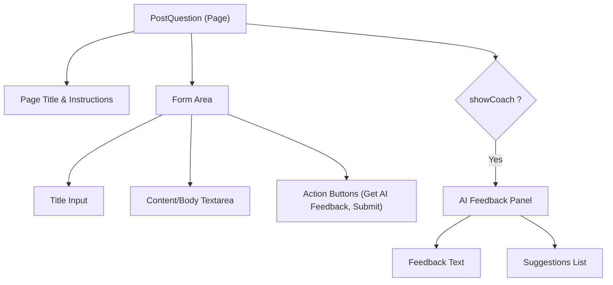

# Task: Post Question Page & AI Draft Coach

## 1. Page Overview
The Post Question page allows users to ask new questions. It includes a form for the title and content, and an integrated "AI Draft Coach" that provides real-time feedback and suggestions before submission.

- **Path**: `/frontend/src/pages/PostQuestion/PostQuestion.jsx`
- **Route**: `/questions/ask`

## 2. Component Hierarchy


## 3. API Integrations
The Post Question page uses `frontend/src/services/question/question.service.js`.

- `generateQuestionDraftCoach({ title, content })` -> `POST /api/questions/draft-coach`
  - Request body: `{ title, content }`
  - Response shape: `{ success, message, data: { tips: string[] } }`
  - Frontend uses `response.data.data.tips` to render the AI suggestions.
- `createQuestion({ title, content })` -> `POST /api/questions`
  - Request body: `{ title, content }`
  - Response shape: `{ success, message, data: { id, questionHash, title, content, userId } }`
  - Frontend uses `response.data.data` to redirect to the published question or confirm success.

Both endpoints require the authenticated user's JWT token in the `Authorization: Bearer <token>` header.

## 4. Detailed Logic
1. **State Management**:
   - `formData`: `{ title: '', content: '' }`
   - `isSubmitting`, `isCoaching` (loading states).
   - `coachFeedback` (object containing tips).
   - `error` and `success` messages.
2. **Form Submission (Create)**:
   - Validate `title` (min 5 chars) and `content` (min 10 chars).
   - Call `createQuestion(formData)`.
   - On success, redirect to `/dashboard` or `/questions/:hash`.
3. **AI Draft Coach**:
   - User clicks "Get AI Feedback".
   - Validate inputs before sending to AI.
   - Call `generateQuestionDraftCoach(formData)`.
   - Render the returned `tips` array in the UI panel.
4. **UI/UX**:
   - Keep buttons disabled during processing (`isSubmitting` / `isCoaching`).
   - Clearly display validation errors (e.g., "Title must be at least 5 characters").

## 5. Git Workflow & PR Checklist
```bash
git checkout main
git pull origin main
git checkout -b feature/FE-post-question
# Make your changes
git add .
git commit -m "[FE] Implement Post Question page and AI Coach"
git push origin feature/FE-post-question
```

### PR Checklist (include in every PR description)
```markdown
- [ ] Code compiles with no errors (`npm run dev` starts cleanly)
- [ ] Postman tests pass for all endpoints in this task (backend tasks)
- [ ] No console errors in the browser (frontend tasks)
- [ ] All acceptance criteria from the task are met
- [ ] Files match the exact paths listed in the task
```